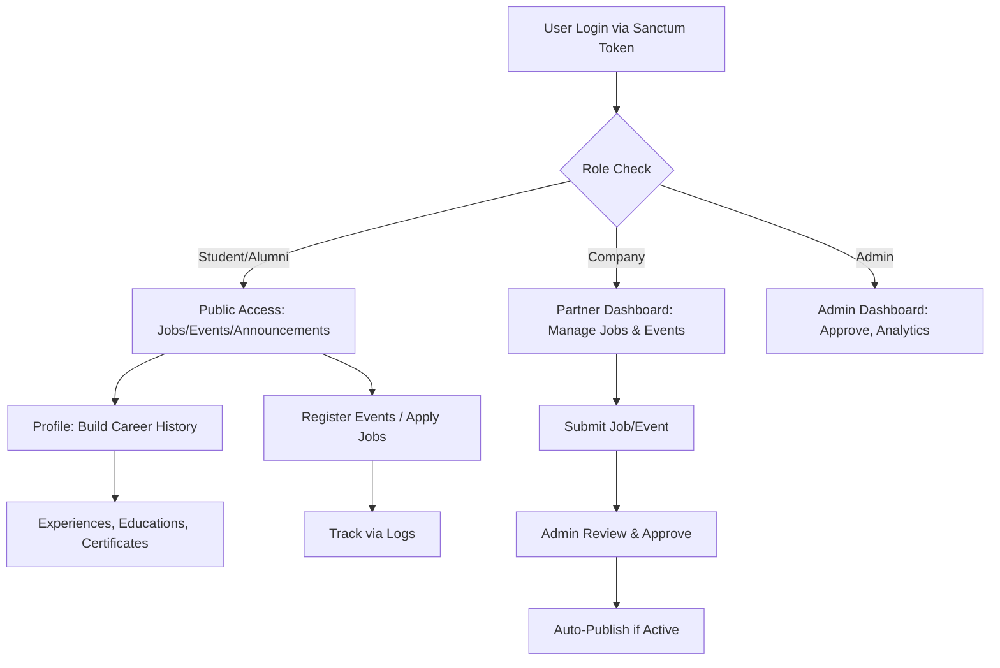

# COMPREHENSIVE ARCHITECTURE REVIEW: Laravel CDC Backend → Express.js Migration

**Reviewer**: Senior Backend Engineer/Software Architect  
**Perspective**: Pragmatic Node.js migration engineer, NOT Laravel evangelist  
**Focus**: Understand system, identify risks, ensure migration success without overengineering  
**Target Stack**: Express.js + TypeScript + Prisma + MySQL + Zod + JWT  

---

## 1. PROJECT OVERVIEW

### 1.1 Application Purpose & Core Domain

**What**: CDC (Career Development Center) Alumni Tracer System
- Alumni engagement & career tracking platform
- Job marketplace with approval workflow
- Event management & registration
- Alumni profile enrichment (experiences, education, certificates)
- Survey/feedback collection system
- Internal admin dashboard

**Core Domain**: 
- **Lifecycle Management**: Content (Jobs/Events) dari Draft → Submitted → Approved → Published → Active/Inactive
- **Career Profile**: Alumni central hub untuk career history
- **Engagement Tracking**: View logs, registrations, application clicks
- **Multi-stakeholder System**: Admin, Companies, Alumni, Students

---

### 1.2 Key Aktor & Role Hierarchy

```
super_admin (SUPER_ADMIN) - Full system control
├── admin_cdc (ADMIN_CDC) - CDC staff, can approve jobs/events
│
company (COMPANY) - Company users
│   └── Can post jobs & events (owned content only)
│
student (STUDENT) / alumni (ALUMNI) - Individual users
    ├── Can view public jobs/events
    ├── Can manage own profile (experience, education, certificates)
    └── Can register for events, submit job applications
```

**CRITICAL**: Role tidak bisa di-set langsung user, hanya admin yang bisa.

---

### 1.3 Main User Flows



---

### 1.4 Critical Dependencies

- **Laravel Sanctum**: Token-based API auth (device-aware)
- **Filament Admin**: Admin dashboard for content management
- **Eloquent**: ORM dengan soft deletes, relationships, scopes
- **Event Log Tables**: For analytics (job clicks, event registrations, announcement views)
- **Optimistic Locking**: Version field on JobVacancy untuk concurrent edit protection
- **Polymorphic Relations**: ApprovalLog tracks any approvable entity

---

## 2. DATABASE ANALYSIS

### 2.1 Entity Overview & Relationships

```
┌─────────────────────────────────────────────────────────────────┐
│ USERS (Core Identity)                                           │
├─────────────────────────────────────────────────────────────────┤
│ id | name | email | password | role | is_active | company_id*  │
│ phone | linkedin_url | graduation_year | program_study         │
│ avatar_path | timestamps | soft_delete                         │
│                                                                  │
│ Relations:                                                       │
│ - belongsTo: Company (nullable, only for COMPANY role)         │
│ - hasMany: Experience, Education, Certificate                 │
│ - hasMany: EventRegistration, JobApplicationLog, ApprovalLog   │
│ - hasMany: AnnouncementView (implicit)                         │
└─────────────────────────────────────────────────────────────────┘
          ↓
┌──────────────────────────────────┐
│ COMPANY (Partner/Org)            │
├──────────────────────────────────┤
│ id | name | slug | industry      │
│ website | email_contact | phone  │
│ address | description            │
│ logo_path | is_active            │
│ approved_at | timestamps         │
│                                  │
│ hasMany: User (company staff)   │
│ hasMany: JobVacancy             │
│ hasMany: Event (optional)       │
└──────────────────────────────────┘

┌──────────────────────────────────────────────────────────────┐
│ JOBS & EVENTS (Content with Approval Workflow)              │
├──────────────────────────────────────────────────────────────┤
│ JOB_VACANCIES                                                │
│ id | company_id* | title | location | employment_type      │
│ description | external_apply_url | poster_path             │
│ approval_status | submitted_at | approved_at | approved_by*│
│ rejected_at | rejected_by* | rejection_reason              │
│ published_at* | expired_at* | is_active | version           │
│ timestamps | soft_delete                                    │
│                                                              │
│ EVENTS                                                       │
│ id | company_id* | title | description | event_type        │
│ organizer | location | registration_deadline               │
│ registration_method | registration_url                      │
│ poster_path | quota | registrations_count                   │
│ approval_status | submitted_at | approved_at | approved_by*│
│ rejected_at | rejected_by* | rejection_reason              │
│ cancelled_at* | cancelled_by* | is_active | published_at*  │
│ timestamps | soft_delete                                    │
│                                                              │
│ Both have:                                                   │
│ - morphMany: ApprovalLog                                    │
│ - belongsTo: Company, ApprovedBy, RejectedBy, CancelledBy  │
└──────────────────────────────────────────────────────────────┘

┌───────────────────────────────────┐
│ APPROVAL_LOGS (Audit Trail)       │
├───────────────────────────────────┤
│ id | approvable_type              │
│ approvable_id | from_status       │
│ to_status | action                │
│ performed_by* | reason            │
│ timestamps                        │
│                                   │
│ belongsTo: User (performed_by)   │
└───────────────────────────────────┘

┌────────────────────────────────────────────┐
│ ENGAGEMENT LOGS (Analytics)                │
├────────────────────────────────────────────┤
│ JOB_APPLICATION_LOGS                       │
│ id | job_id* | user_id* | event_type      │
│ (click, apply) | ip | session_id | url    │
│ created_at                                 │
│                                            │
│ EVENT_LOGS                                 │
│ id | event_id* | user_id*                 │
│ action (view, register, redirect_register)│
│ created_at                                 │
│                                            │
│ ANNOUNCEMENT_VIEWS                         │
│ id | announcement_id* | user_id*          │
│ viewed_at                                  │
└────────────────────────────────────────────┘

┌──────────────────────────────────────────┐
│ CAREER PROFILE (User Content)            │
├──────────────────────────────────────────┤
│ EXPERIENCES                              │
│ id | user_id* | company_name | position │
│ employment_type | location               │
│ start_date | end_date | is_current      │
│ description | timestamps | soft_delete  │
│                                          │
│ EDUCATIONS                               │
│ id | user_id* | institution             │
│ degree | field_of_study | start_year    │
│ end_year | timestamps | soft_delete     │
│                                          │
│ CERTIFICATES                             │
│ id | user_id* | name | issuer           │
│ issue_date | expiry_date | file_path    │
│ file_size | file_mime                   │
│ timestamps | soft_delete                │
└──────────────────────────────────────────┘

┌─────────────────────────────────────────┐
│ ENGAGEMENT (Events/Jobs)                │
├─────────────────────────────────────────┤
│ EVENT_REGISTRATIONS                     │
│ id | event_id* | user_id* | registered_at│
│ deleted_at | (unique: event_id+user_id) │
│                                          │
│ NOTE: Job "applications" are tracked    │
│ via JOB_APPLICATION_LOGS only (no table)│
└─────────────────────────────────────────┘

┌──────────────────────────────────────┐
│ ANNOUNCEMENTS & SURVEYS              │
├──────────────────────────────────────┤
│ ANNOUNCEMENTS                        │
│ id | title | content | category      │
│ priority | target_audience           │
│ redirect_url | is_active             │
│ published_at | expired_at | created_by│
│ timestamps                           │
│                                      │
│ TRACER_SURVEYS                       │
│ id | title | year | description     │
│ is_active | start_date | end_date   │
│ timestamps                          │
│                                      │
│ TRACER_QUESTIONS                     │
│ id | survey_id* | question_text     │
│ question_type | order               │
│                                      │
│ TRACER_RESPONSES                     │
│ id | survey_id* | user_id*          │
│ submitted_at                        │
│                                      │
│ TRACER_ANSWERS                       │
│ id | response_id* | question_id*    │
│ answer_value | answer_json         │
└──────────────────────────────────────┘
```

---

### 2.2 Schema Design Issues & Risks

#### ❌ ISSUE #1: Optimistic Locking Incomplete

**Problem:**
- JobVacancy memiliki `version` field untuk optimistic locking
- Event TIDAK memiliki version field meski juga multi-editor content
- ApprovalService menggunakan version locking di JobVacancy, tapi Event tidak terlindungi

**Impact:**
- **MODERATE**: Race condition saat multiple admins approve job + company update simultaneously
- Event lebih vulnerable karena tidak ada version tracking

**Root Cause:**
- Incomplete implementation (job di-protect, event tidak)
- Mixed concurrency pattern

**Express Migration Implication:**
- HARUS consistent version/locking strategy
- Prisma tidak support optimistic locking natively → manual implementation via `@db.Int` field
- Recommendation: Use middleware to check & increment version di transaction

```typescript
// Express pattern
async function updateJobWithLocking(jobId: number, data: any, currentVersion: number) {
  const updated = await prisma.jobVacancy.updateMany({
    where: { id: jobId, version: currentVersion },
    data: { ...data, version: { increment: 1 } }
  });
  if (updated.count === 0) throw new OptimisticLockException();
  return updated;
}
```

---

#### ❌ ISSUE #2: EventRegistration Soft Delete Confusion

**Problem:**
```php
// Event model
public function registrations() {
  return $this->hasMany(EventRegistration::class)
    ->whereNull('deleted_at');  // ← Manual soft-delete filtering
}
```

- EventRegistration model punya `SoftDeletes` trait
- Query harus manual filter `whereNull('deleted_at')`
- Tapi registrations_count di Event table TIDAK auto-decrement saat soft-delete
- Quota logic menggunakan registrations_count dari DB, bukan actual counted registrations

**Impact:**
- **HIGH**: Event quota bisa penuh padahal ada registrations yg di-delete
- registrations_count jadi inaccurate
- Race condition when multiple users register simultaneously + deletions happen

**Root Cause:**
- Event.registrations_count adalah denormalized counter
- Soft delete tidak update counter
- No cascade logic

**Express Migration Implication:**
- Hindari denormalized counters di database
- Gunakan `COUNT(*)` query atau Prisma aggregate
- Atau: soft-delete adalah logical delete, jangan track di counter

**Recommendation:**
```typescript
// Option A: Aggregate on read
const registrationCount = await prisma.eventRegistration.count({
  where: { eventId, deletedAt: null }
});

// Option B: Remove denormalization
// Delete registrations_count column, compute from join on demand
// Performance: Rarely need full count, usually just check availability
```

---

#### ❌ ISSUE #3: Polymorphic ApprovalLog Not Scalable

**Problem:**
```php
// Approval logs menggunakan morphs (polymorphic)
$table->morphs('approvable');
// Creates: approvable_type + approvable_id
```

- Currently used for JobVacancy & Event only
- If more approval entities added → polymorphic query complexity grows
- JOIN performance degrades with more entity types
- Type safety tidak guaranteed di Laravel, worse di Node.js

**Impact:**
- **MODERATE**: Query performance untuk analytics akan slow
- Harder to query "all approvals by user" across entity types

**Express Migration Implication:**
- Polymorphic relations adalah anti-pattern di modern architecture
- Better: Separate table per entity type (job_approval_logs, event_approval_logs)
- Or: Single logs table dengan explicit entity_type + better indexing

```typescript
// Better Prisma model
model ApprovalLog {
  id: Int
  entityType: 'JOB' | 'EVENT'
  entityId: Int
  fromStatus: String
  toStatus: String
  action: String
  performedById: Int
  reason: String
  createdAt: DateTime
  
  indexes:
    @@index([entityType, entityId])
    @@index([performedById])
    @@index([toStatus])
}
```

---

#### ✅ GOOD PATTERN: Workflow State Machines

**Good:**
- Approval workflow punya clear states: DRAFT → SUBMITTED → APPROVED/REJECTED → CANCELLED
- ApprovalStatus enum enforce valid transitions
- ApprovalService single source of truth untuk state transitions
- Cannot bypass via direct model update (guarded fields + bypassWorkflowGuard flag)

**Migration To Express:**
- Keep state machine logic, move to service layer
- Use Zod for state validation
- Type-safe transitions dengan TypeScript discriminated unions

```typescript
// Express equivalent
type ApprovalState = 
  | { status: 'DRAFT'; submittedAt: null }
  | { status: 'SUBMITTED'; submittedAt: Date }
  | { status: 'APPROVED'; approvedAt: Date; approvedBy: number }
  | { status: 'REJECTED'; rejectedAt: Date; reason: string }
  | { status: 'CANCELLED'; cancelledAt: Date };

// Type-safe transitions
function canTransition(from: ApprovalState, to: ApprovalState): boolean {
  // ...
}
```

---

#### ✅ GOOD PATTERN: Guarded Fields + Business Logic

**Good:**
```php
protected $guarded = [
  'approval_status', 'version', 'published_at',
  'submitted_at', 'approved_at', ...
];

protected static function booted() {
  static::updating(function ($model) {
    if ($model->isDirty('approval_status')) {
      throw new \LogicException('Use ApprovalService instead');
    }
  });
}
```

- Workflow fields tidak bisa di-update langsung
- Force use of ApprovalService
- Workflow integrity protected at ORM level

**Migration to Express:**
- Implement in controller/service layer
- Use middleware to validate request shape
- Database constraints + application layer validation (defense in depth)

---

### 2.3 Query Hotspots & N+1 Risks

#### 🔴 HIGH RISK: Job List Query

```php
// JobController::index
$query = JobVacancy::published()
  ->with('company:id,name')  // ← Good, eager load
  ->paginate(perPage)
```

**Good:**
- Sudah eager load company
- Published scope efficient

**Risk:**
- If future feature add job owner count, applicant count → N+1
- No indexing strategy documented
- Job descriptions bisa besar (text field) → SELECT * wasteful

---

#### 🔴 HIGH RISK: Event Registration Quota Check

```php
// EventController::register
$locked = Event::whereKey($event->id)->lockForUpdate()->firstOrFail();
$updated = Event::whereKey($locked->id)
  ->whereColumn('registrations_count', '<', 'quota')
  ->update(['registrations_count' => DB::raw('registrations_count + 1')]);
```

**Good:**
- Pessimistic locking untuk quota safety ✅
- Atomic increment query ✅

**Risk:**
- Lock duration too long if queries slow
- EventRegistration insert BEFORE increment → 2 trips to DB

**Express Migration:**
- Keep locking pattern
- Use transaction for atomicity
- Consider Prisma's transaction isolation level

---

#### 🟡 MODERATE RISK: Announcement View Tracking

```php
// AnnouncementController::show
DB::afterCommit(function () {
  AnnouncementView::create([...]);
});
```

**Good:**
- Logged AFTER transaction commit (no blocking)

**Risk:**
- If AnnouncementView inserts slow → accumulated lag
- No batch insert strategy

---

### 2.4 Weak Schema Patterns

| Issue | Location | Impact | Fix |
|-------|----------|--------|-----|
| **No unique constraint on event_registrations** | EventRegistration::create() tries unique in code but no DB constraint | Can insert duplicate registrations if race condition | Add unique index(event_id, user_id) + soft_deleted |
| **registrations_count denormalized** | Event model | Quota logic inaccurate after soft deletes | Use COUNT() aggregation |
| **job_application_logs has no unique constraint** | JobApplicationLog::create | Can double-log same apply | Add unique (job_id, user_id, event_type) or remove duplicates in query |
| **No user_id index on certificates** | Certificate model | Slow query for "user's certificates" | Add index(user_id) |
| **created_by not FK on Announcement** | Announcement::create_by | Data integrity risk | Add FK: created_by → users.id |
| **company_id nullable on Event** | Event model | unclear if event can have no owner | Docs needed; consider NOT NULL for non-system events |

---

### 2.5 Recommendation: Express Prisma Schema Structure

```prisma
// Recommended structure (simplified)
model User {
  id          Int      @id @default(autoincrement())
  email       String   @unique
  password    String   @db.VarChar(255)
  role        UserRole
  isActive    Boolean  @default(true)
  companyId   Int?
  company     Company? @relation(fields: [companyId], references: [id])
  
  // Relations
  experiences       Experience[]
  educations        Education[]
  certificates      Certificate[]
  eventRegistrations EventRegistration[]
  approvalLogs      ApprovalLog[] @relation("performedBy")
  
  createdAt   DateTime @default(now())
  updatedAt   DateTime @updatedAt
  deletedAt   DateTime?
  
  @@index([role])
  @@index([isActive])
  @@index([companyId])
}

model JobVacancy {
  id                  Int     @id
  companyId           Int
  company             Company @relation(fields: [companyId], references: [id], onDelete: Cascade)
  
  title               String
  location            String?
  employmentType      String
  description         String  @db.Text
  externalApplyUrl    String
  posterPath          String?
  
  approvalStatus      ApprovalStatus @default(DRAFT)
  submittedAt         DateTime?
  approvedAt          DateTime?
  approvedById        Int?
  rejectedAt          DateTime?
  rejectionReason     String?
  
  publishedAt         DateTime?
  expiredAt           DateTime?
  isActive            Boolean @default(false)
  version             Int     @default(0)
  
  // Relations
  approvalLogs        ApprovalLog[]
  applicationLogs     JobApplicationLog[]
  
  createdAt           DateTime @default(now())
  updatedAt           DateTime @updatedAt
  deletedAt           DateTime?
  
  @@index([companyId])
  @@index([approvalStatus])
  @@index([publishedAt, expiredAt])
  @@unique([id, version])  // For optimistic locking
}

model EventRegistration {
  id          Int      @id
  eventId     Int
  userId      Int
  registeredAt DateTime
  
  event       Event @relation(fields: [eventId], references: [id], onDelete: Cascade)
  user        User  @relation(fields: [userId], references: [id], onDelete: Cascade)
  
  deletedAt   DateTime?
  
  @@unique([eventId, userId])
  @@index([userId])
}

// Remove registrations_count from Event
// Compute on-demand: await prisma.eventRegistration.count({where: {eventId, deletedAt: null}})
```

---

## 3. AUTH & AUTHORIZATION ANALYSIS

### 3.1 Current Authentication Flow

```
┌─────────────────────────────────────────────────────┐
│ 1. POST /api/v1/auth/login (public, throttle:5/min) │
│    Email + Password                                 │
└────────────────────┬────────────────────────────────┘
                     ↓
┌─────────────────────────────────────────────────────┐
│ 2. AuthController::login                            │
│    - Find user by email                             │
│    - Hash check password (anti-timing attack)       │
│    - Verify user is active                          │
│    - Block admin (mobile only)                      │
└────────────────────┬────────────────────────────────┘
                     ↓
┌─────────────────────────────────────────────────────┐
│ 3. Sanctum Token Generation                         │
│    - Device-aware: per-device token tracking        │
│    - Replace old token for same device              │
│    - Format: Bearer token (plain text + hashed)     │
└────────────────────┬────────────────────────────────┘
                     ↓
┌─────────────────────────────────────────────────────┐
│ 4. Response: {token, user}                          │
│    - Token stored in Authorization: Bearer <token> │
└─────────────────────────────────────────────────────┘
                     ↓
┌─────────────────────────────────────────────────────┐
│ 5. Subsequent Requests                              │
│    - Middleware auth:sanctum validates token        │
│    - Sets $request->user() context                  │
└─────────────────────────────────────────────────────┘
```

**Token Storage (Laravel Sanctum):**
- Personal access tokens stored in `personal_access_tokens` table
- Hash of token stored (full token sent only at creation)
- Device name for tracking

---

### 3.2 Authorization Model

#### Role-Based Access Control (RBAC) Only
```
super_admin/admin_cdc
├─ Can approve/reject jobs & events
├─ Can cancel approved content
├─ Can view analytics
├─ Can manage companies
├─ Can view all user profiles
└─ Can view all tracer responses

company
├─ Can create/edit own jobs & events (draft state only)
├─ Can submit for approval
├─ Can revert/edit after rejection
└─ Can view own content analytics

student/alumni
├─ Can view published jobs, events, announcements
├─ Can build own profile (experiences, education, certificates)
├─ Can register for events
├─ Can apply for jobs
└─ Can submit tracer surveys
```

#### Authorization Checks
```php
// Gates & Policies approach (Laravel style)
$this->authorize('viewAny', Experience::class);      // Resource policy
$this->authorize('update', $experience);             // Model policy
$this->authorize('approve', $job);                   // Custom gate
```

**Policies Implemented:**
- `ExperiencePolicy` - User dapat view/update/delete own experiences
- `EducationPolicy` - Similar to experience
- `CertificatePolicy` - Similar but with file download access
- `EventPolicy` - Visibility by role (admin > all, public > published)
- `JobVacancyPolicy` - Similar to event
- `UserPolicy` - Restrict profile access (MVP: owner + admin only)

**CRITICAL Issues:**
1. **No explicit company ownership validation** - Service layer assumes user.company_id matches job.company_id
2. **Policies are single-method** - No reuse of common patterns
3. **No attribute-based access control** - Only role + ownership checks, no fine-grained permissions
4. **Event access loosely defined** - Comment says "MVP mode"

---

### 3.3 Key Security Findings

#### ✅ GOOD: Timing Attack Prevention

```php
// AuthController::login
$dummyHash = '$2y$10$usesomesillystringfore7hnbRJHxXVLeakoG8K30oukPsA.ztMG';
$passwordValid = $user
  ? Hash::check($data['password'], $user->password)
  : Hash::check($data['password'], $dummyHash);
```

- Always hash check even if user not found
- Prevents user enumeration via timing

---

#### ✅ GOOD: Device-Aware Token Strategy

```php
$deviceName = $request->input('device_name') ?? $request->userAgent() ?? 'mobile';
$user->tokens()->where('name', $deviceName)->delete();  // Per-device replace
$token = $user->createToken($deviceName)->plainTextToken;
```

- One token per device per user
- Logout revokes only that device
- Prevents token proliferation

---

#### ⚠️  MODERATE: Role Cannot Be Changed (Good), But Enforced via Model Event

```php
protected static function booted() {
  static::updating(function ($user) {
    if ($user->isDirty('role')) {
      throw new \LogicException('Role cannot be changed directly.');
    }
  });
}
```

- Good intent: role is immutable
- **Problem**: ORM-level enforcement = easy to bypass if model not used
- **Better**: Database constraint + validation layer

---

#### ❌ BAD: Company Required Only Checked at ORM Level

```php
if ($user->role === UserRole::COMPANY && ! $user->company_id) {
  throw new \LogicException('Company user must have company_id.');
}
```

- Not a database constraint
- Only triggered if user saved through model
- Direct SQL insert can violate this

---

#### ❌ BAD: Is-Active Status Immutable via ORM Only

```php
if ($user->isDirty('is_active')) {
  throw new \LogicException('Status cannot be changed directly.');
}
```

- Implies there's a service to manage status
- But service not visible in code
- How does admin deactivate user?

---

### 3.4 Session & Token Management

**Current**: 
- Sanctum tokens (no expiry, no refresh token)
- Device-aware per-device revocation
- No session table usage (web guard not used)

**Missing**:
- Token expiry/refresh token strategy
- Device geolocation tracking
- Suspicious login alerts
- Session invalidation on password change

---

### 3.5 Express.js JWT Implementation Strategy

**Recommended Approach:**

```typescript
// Instead of Sanctum tokens:
// 1. Access token (short-lived, 15min, in bearer header)
// 2. Refresh token (long-lived, 7d, in httpOnly cookie)
// 3. Device fingerprinting for extra security

// auth.service.ts
export class AuthService {
  async login(email: string, password: string, deviceFingerprint: string) {
    const user = await this.validateCredentials(email, password);
    
    const tokens = await this.generateTokens(user, deviceFingerprint);
    
    // Store refresh token in DB (optional)
    await prisma.refreshToken.create({
      userId: user.id,
      token: tokens.refreshToken,
      deviceFingerprint,
      expiresAt: addDays(new Date(), 7)
    });
    
    return {
      accessToken: tokens.accessToken,
      refreshToken: tokens.refreshToken, // in httpOnly cookie
      user: { id: user.id, email: user.email, role: user.role }
    };
  }

  async refreshToken(oldRefreshToken: string) {
    const stored = await prisma.refreshToken.findUnique({
      where: { token: oldRefreshToken }
    });
    
    if (!stored || stored.expiresAt < now()) throw new UnauthorizedException();
    
    const user = await prisma.user.findUnique({where: {id: stored.userId}});
    const newTokens = this.generateTokens(user, stored.deviceFingerprint);
    
    // Rotate refresh token
    await prisma.refreshToken.update({
      where: { id: stored.id },
      data: { token: newTokens.refreshToken }
    });
    
    return newTokens;
  }
}

// middleware/auth.ts
export function authMiddleware(req: Request, res: Response, next: NextFunction) {
  const token = req.headers.authorization?.replace('Bearer ', '');
  if (!token) return res.status(401).json({ error: 'Unauthorized' });
  
  try {
    const payload = jwt.verify(token, process.env.JWT_SECRET);
    req.user = payload;
    next();
  } catch (err) {
    res.status(401).json({ error: 'Invalid token' });
  }
}
```

---

### 3.6 Express Authorization Pattern

```typescript
// types/auth.ts
export type AuthUser = {
  id: number;
  email: string;
  role: 'super_admin' | 'admin_cdc' | 'company' | 'student' | 'alumni';
  isActive: boolean;
  companyId?: number;
};

// middleware/authorize.ts
export function authorize(...allowedRoles: string[]) {
  return (req: Request, res: Response, next: NextFunction) => {
    if (!allowedRoles.includes(req.user?.role)) {
      return res.status(403).json({ error: 'Forbidden' });
    }
    next();
  };
}

// middleware/ownership.ts
export async function checkJobOwnership(req: Request, res: Response, next: NextFunction) {
  const job = await prisma.jobVacancy.findUnique({
    where: { id: parseInt(req.params.id) }
  });
  
  if (!job) return res.status(404).json({ error: 'Not found' });
  
  const canAccess = req.user.role === 'admin_cdc' || 
                    (job.companyId === req.user.companyId);
  
  if (!canAccess) return res.status(403).json({ error: 'Forbidden' });
  
  req.job = job;
  next();
}

// usage
router.patch('/jobs/:id', authMiddleware, authorize('company', 'admin_cdc'), 
  checkJobOwnership, updateJobController);
```

---

## 4. MODULE BREAKDOWN FOR EXPRESS

### 4.1 Recommended Module Structure

Based on domain analysis, here's the pragmatic module split:

```
src/modules/
├── auth/
│   ├── auth.controller.ts      # login, logout, refresh, me
│   ├── auth.service.ts         # token generation, validation
│   ├── auth.routes.ts
│   ├── auth.schema.ts          # Zod schemas
│   └── types.ts
│
├── users/
│   ├── users.controller.ts     # get profile, update profile
│   ├── users.service.ts
│   ├── users.routes.ts
│   ├── users.schema.ts
│   ├── types.ts
│   └── policies.ts             # Authorization checks
│
├── profile/                     # Career profile (experiences, education, certificates)
│   ├── profile.controller.ts
│   ├── profile.service.ts
│   ├── profile.routes.ts
│   ├── profile.schema.ts
│   ├── experiences.service.ts  # Extraction for single responsibility
│   ├── educations.service.ts
│   ├── certificates.service.ts
│   └── types.ts
│
├── jobs/                        # Job vacancies
│   ├── jobs.controller.ts       # List public, show, apply, click
│   ├── jobs.service.ts
│   ├── jobs.routes.ts
│   ├── jobs.schema.ts
│   ├── jobs.policies.ts         # Ownership validation
│   └── types.ts
│
├── events/
│   ├── events.controller.ts     # List public, show, register
│   ├── events.service.ts
│   ├── events.routes.ts
│   ├── events.schema.ts
│   ├── events.policies.ts
│   └── types.ts
│
├── announcements/
│   ├── announcements.controller.ts
│   ├── announcements.service.ts
│   ├── announcements.routes.ts
│   ├── announcements.schema.ts
│   └── types.ts
│
├── approval/                    # Workflow state machine
│   ├── approval.service.ts      # Core: submit, approve, reject, cancel, revert
│   ├── approval.types.ts        # Enum states, types
│   ├── rules/
│   │   ├── job-approval-rules.ts
│   │   └── event-approval-rules.ts
│   └── approval.constants.ts    # Transition tables
│
├── surveys/
│   ├── surveys.controller.ts    # tracer survey
│   ├── surveys.service.ts
│   ├── surveys.routes.ts
│   ├── surveys.schema.ts
│   └── types.ts
│
├── companies/
│   ├── companies.service.ts     # For internal use (job owner)
│   └── types.ts
│
├── analytics/
│   ├── analytics.service.ts     # Query logs for dashboards
│   ├── analytics.routes.ts
│   └── types.ts
│
├── admin/                       # Dashboard, approval management
│   ├── admin.controller.ts
│   ├── admin.service.ts
│   ├── admin.routes.ts
│   └── types.ts
│
└── logs/
    ├── logs.service.ts          # Event/job/announcement tracking
    └── types.ts
```

---

### 4.2 Module Responsibilities & Dependencies

| Module | Responsibility | Depends On | Coupling Level |
|--------|-----------------|-----------|-----------------|
| **auth** | Login/logout/token mgmt | - | Low |
| **users** | User profile CRUD | auth, profile | Low-Mod |
| **profile** | Career history (exp, edu, cert) | users, file storage | Low |
| **jobs** | Job listing, details, apply, search | approval, companies, logs | Mod |
| **events** | Event listing, registration, quota | approval, logs | Mod |
| **announcements** | Announcement CRUD, filtering | logs | Low |
| **approval** | State machine (universal) | *all content modules* | HIGH |
| **surveys** | Tracer survey CRUD | users | Low |
| **companies** | Company data (internal) | jobs, events | Low |
| **analytics** | Dashboard queries | logs, all | Low-Mod |
| **admin** | Admin dashboard | approval, analytics, users | Mod |
| **logs** | Event tracking | - | Low |

**KEY INSIGHT**: `approval` module is highest coupling - it's injected into jobs/events.

---

### 4.3 Approval Module Deep Dive

**This is THE critical module for migration success.**

Current Laravel structure:
```php
// ApprovalService (generic state machine)
public function submit(Model $model, User $actor, ApprovalRules $rules): Model
public function approve(Model $model, User $actor, ApprovalRules $rules): Model
public function reject(Model $model, User $actor, string $reason, ApprovalRules $rules)
public function revert(Model $model, User $actor, ApprovalRules $rules)
public function cancel(Model $model, User $actor, ApprovalRules $rules)

// JobApprovalRules implements ApprovalRules (specific to jobs)
public function canSubmit(Model $model, User $actor): bool
public function canApprove(Model $model, User $actor): bool
public function validateTransition(Model $model, User $actor, $from, $to)
public function onSubmit(Model $model, User $actor)
public function onApprove(Model $model, User $actor)
public function onReject(Model $model, User $actor, $reason)
```

**Express Equivalent:**

```typescript
// approval.types.ts
export type ApprovalStatus = 'DRAFT' | 'SUBMITTED' | 'APPROVED' | 'REJECTED' | 'CANCELLED';

export interface ApprovalLog {
  id: number;
  entityType: 'JOB' | 'EVENT';
  entityId: number;
  fromStatus: ApprovalStatus;
  toStatus: ApprovalStatus;
  action: 'submit' | 'approve' | 'reject' | 'cancel' | 'revert';
  performedById: number;
  reason?: string;
  createdAt: Date;
}

export interface ApprovalRules {
  canSubmit(entity: any, actor: AuthUser): boolean;
  canApprove(entity: any, actor: AuthUser): boolean;
  canReject(entity: any, actor: AuthUser, reason?: string): boolean;
  canRevert(entity: any, actor: AuthUser): boolean;
  canCancel(entity: any, actor: AuthUser): boolean;
  
  validateTransition(entity: any, actor: AuthUser, from: ApprovalStatus, to: ApprovalStatus): void;
  
  onSubmit(entity: any, actor: AuthUser): Promise<void>;
  onApprove(entity: any, actor: AuthUser): Promise<void>;
  onReject(entity: any, actor: AuthUser, reason: string): Promise<void>;
  onRevert(entity: any, actor: AuthUser): Promise<void>;
  onCancel(entity: any, actor: AuthUser): Promise<void>;
}

// approval.service.ts
export class ApprovalService {
  private transitionMap: Record<ApprovalStatus, ApprovalStatus[]> = {
    'DRAFT': ['SUBMITTED'],
    'SUBMITTED': ['APPROVED', 'REJECTED'],
    'APPROVED': ['DRAFT', 'CANCELLED'],
    'REJECTED': ['DRAFT'],
    'CANCELLED': [],
  };

  async submit(
    entity: any,
    actor: AuthUser,
    rules: ApprovalRules
  ): Promise<any> {
    return this.transition(entity, actor, 'SUBMITTED', 'submit', rules);
  }

  async approve(
    entity: any,
    actor: AuthUser,
    rules: ApprovalRules
  ): Promise<any> {
    return this.transition(entity, actor, 'APPROVED', 'approve', rules);
  }

  private async transition(
    entity: any,
    actor: AuthUser,
    toStatus: ApprovalStatus,
    action: string,
    rules: ApprovalRules
  ): Promise<any> {
    return prisma.$transaction(async (tx) => {
      const fromStatus = entity.approvalStatus;

      // Idempotent
      if (fromStatus === toStatus) return entity;

      // Check valid transition
      if (!this.transitionMap[fromStatus]?.includes(toStatus)) {
        throw new InvalidTransitionException(
          `Cannot transition from ${fromStatus} to ${toStatus}`
        );
      }

      // Authorization
      const canPerform = await this.authorize(action, rules, entity, actor);
      if (!canPerform) throw new UnauthorizedException();

      // Domain rules
      rules.validateTransition(entity, actor, fromStatus, toStatus);

      // Apply hooks
      await this.applyHook(entity, actor, action, rules);

      // Update with optimistic locking
      const updated = await tx.jobVacancy.updateMany({
        where: { id: entity.id, version: entity.version },
        data: {
          approvalStatus: toStatus,
          version: { increment: 1 },
          ...(this.getStatusFields(toStatus, actor))
        }
      });

      if (updated.count === 0) {
        throw new OptimisticLockException();
      }

      // Log
      await tx.approvalLog.create({
        entityType: entity._type,
        entityId: entity.id,
        fromStatus,
        toStatus,
        action,
        performedById: actor.id,
        reason: (this.pendingReason || undefined)
      });
    });
  }

  private async authorize(
    action: string,
    rules: ApprovalRules,
    entity: any,
    actor: AuthUser
  ): boolean {
    switch (action) {
      case 'submit': return rules.canSubmit(entity, actor);
      case 'approve': return rules.canApprove(entity, actor);
      case 'reject': return rules.canReject(entity, actor);
      case 'revert': return rules.canRevert(entity, actor);
      case 'cancel': return rules.canCancel(entity, actor);
      default: return false;
    }
  }

  private getStatusFields(status: ApprovalStatus, actor: AuthUser) {
    switch (status) {
      case 'SUBMITTED':
        return { submittedAt: new Date() };
      case 'APPROVED':
        return { approvedAt: new Date(), approvedById: actor.id };
      case 'REJECTED':
        return { rejectedAt: new Date(), rejectedById: actor.id };
      case 'CANCELLED':
        return { cancelledAt: new Date(), cancelledById: actor.id };
      default:
        return {};
    }
  }
}

// rules/job-approval-rules.ts
export class JobApprovalRules implements ApprovalRules {
  canSubmit(job: any, actor: AuthUser): boolean {
    if (!actor.isActive) return false;
    if (actor.role === 'admin_cdc') {
      return ['DRAFT', 'REJECTED'].includes(job.approvalStatus);
    }
    if (actor.role === 'company') {
      return job.companyId === actor.companyId &&
             ['DRAFT', 'REJECTED'].includes(job.approvalStatus);
    }
    return false;
  }

  canApprove(job: any, actor: AuthUser): boolean {
    return actor.isActive && actor.role === 'admin_cdc' && 
           job.approvalStatus === 'SUBMITTED';
  }

  // ... etc
}
```

---

### 4.4 Module Boundaries & Communication

```
PUBLIC API LAYER
      ↓
┌─────────────────────────────────────────────┐
│ Jobs Controller → Jobs Service              │ (jobs module)
│                     ↓                        │
│              Need approval? ──→  Approval    │ (approval module)
│                                  Service    │
│                                     ↓       │
│              Apply? ──→ Logs Service         │ (logs module)
└─────────────────────────────────────────────┘

KEY PRINCIPLE: Modules communicate via services, NOT via direct DB queries
```

**Anti-pattern (AVOID):**
```typescript
// DON'T DO THIS
router.post('/jobs/:id/approve', async (req, res) => {
  const job = await prisma.jobVacancy.findUnique({where: {id}});
  job.approvalStatus = 'APPROVED';
  job.approvedAt = new Date();
  job.approvedById = req.user.id;
  await prisma.jobVacancy.update({where: {id}, data: job});
  // Workflow bypassed! No logging, no rules checked!
});
```

**Correct:**
```typescript
router.post('/jobs/:id/approve', authMiddleware, async (req, res) => {
  const jobService = new JobService();
  const approvalService = new ApprovalService();
  const rules = new JobApprovalRules();
  
  const job = await jobService.getJob(req.params.id);
  await approvalService.approve(job, req.user, rules);
  
  res.json({ success: true });
});
```

---

## 5. API ANALYSIS

### 5.1 Current API Endpoints

```
PUBLIC (no auth required, throttled)
├── GET  /v1/announcements
├── GET  /v1/announcements/:id
├── GET  /v1/jobs
├── GET  /v1/jobs/:id
├── GET  /v1/events
├── GET  /v1/events/:id
└── POST /v1/auth/login

PROTECTED (auth required)
├── POST   /v1/auth/logout
├── GET    /v1/me
├── POST   /v1/jobs/:id/apply
│
├── GET    /v1/profile
├── PUT    /v1/profile
│
├── GET    /v1/profile/experiences
├── POST   /v1/profile/experiences
├── PUT    /v1/profile/experiences/:id
├── DELETE /v1/profile/experiences/:id
│
├── GET    /v1/profile/educations
├── POST   /v1/profile/educations
├── PUT    /v1/profile/educations/:id
├── DELETE /v1/profile/educations/:id
│
├── POST   /v1/profile/certificates
├── GET    /v1/profile/certificates/:id/download
│
├── GET    /v1/events/my
├── POST   /v1/events/:id/register
│
├── GET    /v1/tracer/survey
└── POST   /v1/tracer/survey/submit

FILAMENT ADMIN PANEL (admin only, web-based)
└── [Separate Filament routing, not API]
```

---

### 5.2 Response Pattern Analysis

#### INCONSISTENCY #1: Response Wrapper Format

```
// Jobs API
GET /v1/jobs
{
  data: [...],
  links: {...},
  meta: {...}
}

// Announcements API
GET /v1/announcements
{
  data: [...]  // No links/meta!
}

// Jobs Show
GET /v1/jobs/1
{
  data: { id, title, ... }
}

// Auth Login
POST /v1/auth/login
{
  success: true,
  data: { token, user },
  message: null
}

// Profile Show
GET /v1/profile
{
  id, name, email, role, profile: { ... }  // No wrapper!
}
```

**PROBLEM:**
- Inconsistent response envelope
- Some use `{data}`, some use `{success, data}`
- Some return data directly
- Client can't parse consistently

**Express Fix:**
```typescript
// middleware/response.ts
export interface ApiResponse<T> {
  success: boolean;
  message?: string;
  data?: T;
  errors?: Record<string, string[]>;
  meta?: {
    page: number;
    perPage: number;
    total: number;
    lastPage: number;
  };
}

export const successResponse = (data: any, message?: string, meta?: any) => ({
  success: true,
  message,
  data,
  meta
});

export const errorResponse = (message: string, errors?: any) => ({
  success: false,
  message,
  errors
});

// Usage in all controllers
res.json(successResponse(jobs, null, {page, perPage, total}));
res.json(errorResponse('Validation failed', errors));
```

---

#### INCONSISTENCY #2: Pagination

```
// Jobs: Laravel pagination
{
  data: [...],
  current_page: 1,
  per_page: 20,
  total: 100,
  last_page: 5,
  links: { first, last, prev, next }
}

// Announcements: Manual response, no pagination

// Events: Paginated via ->paginate()
```

**Express Fix:**
- Use consistent pagination middleware
- Support `page` & `per_page` query params
- Return consistent meta envelope

---

#### INCONSISTENCY #3: Search/Filter

```
// Jobs
?search=keyword
?employment_type=fulltime  // enum validation in controller
?location=Jakarta
?per_page=20

// Events  
?search=keyword
?event_type=workshop
?upcoming=true

// Announcements
?search=keyword
?category=career
?priority=urgent
```

**Problems:**
- No validation of enum values (security)
- Search is unindexed LIKE query (performance)
- No cursor-based pagination option

---

### 5.3 Request Validation Pattern

**Current (Laravel):**
```php
class StoreExperienceRequest extends FormRequest {
  public function rules() {
    return [
      'company_name' => 'required|string|max:150',
      'position' => 'required|string|max:150',
      'employment_type' => 'required|in:fulltime,parttime,intern,remote',
      'start_date' => 'required|date',
      'end_date' => 'required|date|after_or_equal:start_date',
      'is_current' => 'boolean',
      'description' => 'nullable|string|max:1000',
    ];
  }
}
```

**Express with Zod:**
```typescript
const StoreExperienceSchema = z.object({
  company_name: z.string().min(1).max(150),
  position: z.string().min(1).max(150),
  employment_type: z.enum(['fulltime', 'parttime', 'intern', 'remote']),
  start_date: z.string().date(),
  end_date: z.string().date(),
  is_current: z.boolean().default(false),
  description: z.string().max(1000).optional(),
}).refine(
  (data) => new Date(data.start_date) <= new Date(data.end_date),
  { message: 'End date must be after start date', path: ['end_date'] }
);

type StoreExperienceInput = z.infer<typeof StoreExperienceSchema>;

// middleware/validateRequest.ts
export const validateRequest = (schema: ZodSchema) => (req: Request, res: Response, next: NextFunction) => {
  try {
    req.validated = schema.parse(req.body);
    next();
  } catch (err) {
    if (err instanceof z.ZodError) {
      return res.status(422).json({
        success: false,
        message: 'Validation failed',
        errors: err.flatten().fieldErrors
      });
    }
    next(err);
  }
};

// Usage
router.post('/experiences', authMiddleware, validateRequest(StoreExperienceSchema), storeExperienceController);
```

---

### 5.4 Throttling & Rate Limiting

**Current:**
```php
Route::middleware('throttle:120,1')->group(...)   // 120 req/min
Route::middleware('throttle:5,1')->group(...)     // 5 req/min for login
Route::middleware('throttle:60,1')->group(...)    // 60 req/min for apply
Route::middleware('throttle:30,1')->group(...)    // 30 req/min for profile
```

**Express Equivalent:**
```typescript
import rateLimit from 'express-rate-limit';

export const defaultLimiter = rateLimit({
  windowMs: 1 * 60 * 1000, // 1 minute
  max: 120,
  skip: (req) => req.user?.role === 'admin', // Admins not throttled
  message: 'Too many requests, please try again later'
});

export const loginLimiter = rateLimit({
  windowMs: 1 * 60 * 1000,
  max: 5,
  skipSuccessfulRequests: true  // Only count failed attempts
});

export const applyLimiter = rateLimit({
  windowMs: 1 * 60 * 1000,
  max: 60
});

// Usage
router.post('/auth/login', loginLimiter, loginController);
router.post('/jobs/:id/apply', applyLimiter, applyController);
```

---

### 5.5 Error Response Pattern

**Current Errors:**
```php
// Success
{ success: true, data: {...}, message: null }

// Validation error
? (Not shown in code)

// Not found
abort(404) → Laravel default

// Forbidden
abort(403)

// Custom error
{
  success: false,
  message: 'User inactive'
}

// Status code inconsistency
- Sometimes 401, sometimes 403
- Sometimes abort(), sometimes response()->json()
```

**Express Standardization:**

```typescript
// errors/AppError.ts
export class AppError extends Error {
  constructor(
    public message: string,
    public statusCode: number = 500,
    public errors?: Record<string, string[]>
  ) {
    super(message);
    this.name = this.constructor.name;
  }
}

export class ValidationError extends AppError {
  constructor(errors: Record<string, string[]>) {
    super('Validation failed', 422, errors);
  }
}

export class UnauthorizedError extends AppError {
  constructor(message = 'Unauthorized') {
    super(message, 401);
  }
}

export class ForbiddenError extends AppError {
  constructor(message = 'Forbidden') {
    super(message, 403);
  }
}

export class NotFoundError extends AppError {
  constructor(message = 'Not found') {
    super(message, 404);
  }
}

// middleware/errorHandler.ts
export const errorHandler = (err: any, req: Request, res: Response, next: NextFunction) => {
  if (err instanceof AppError) {
    return res.status(err.statusCode).json({
      success: false,
      message: err.message,
      errors: err.errors
    });
  }
  
  // Unexpected error
  console.error(err);
  res.status(500).json({
    success: false,
    message: process.env.NODE_ENV === 'production' 
      ? 'Internal server error' 
      : err.message
  });
};

// Usage
throw new ValidationError({ email: ['Email already taken'] });
throw new UnauthorizedError('Invalid credentials');
throw new ForbiddenError('You cannot access this resource');
```

---

### 5.6 API Recommendations

| Issue | Impact | Fix |
|-------|--------|-----|
| Inconsistent response format | Client parsing hell | Standardize all endpoints |
| No API versioning strategy | Breaking changes nightmare | URL versioning: /v1/, /v2/ |
| Weak enum validation (employment_type) | Garbage data in DB | Use Zod enums |
| LIKE search unindexed | Query slow at scale | Use full-text search or DB indexes |
| No cursor pagination | Offset pagination inefficient | Add cursor option |
| No DTO/response shape docs | Frontend guessing | Use OpenAPI/Swagger |
| Throttle via middleware only | Easy to bypass | Rate limiting middleware + DB checks |

---

## 6. BUSINESS LOGIC ANALYSIS

### 6.1 Critical Business Rules

#### RULE #1: Content Approval Workflow

**State Machine:**
```
DRAFT ──submit──> SUBMITTED ──approve──> APPROVED ──can_cancel──> CANCELLED
                         ↓
                       reject ──> REJECTED ──revert──> DRAFT
                                                  OR
                                        ──admin_revert──> DRAFT
```

**Side Effects on Approve:**
```php
// JobApprovalRules::onApprove
$model->is_active = true;        // Auto-activate
$model->published_at = now();    // Auto-publish
```

**Side Effects on Reject:**
```php
$model->is_active = false;       // Deactivate
$model->published_at = null;     // Unpublish
```

**ISSUE**: Auto-activation on approve adalah design choice yang perlu di-clarify.
- Pro: Seamless workflow
- Con: No separate "publish" step, admin approval = instant visibility

**Express Implementation:**
```typescript
async approve(job: JobVacancy, actor: AuthUser, rules: JobApprovalRules) {
  const result = await prisma.$transaction(async (tx) => {
    const updated = await tx.jobVacancy.update({
      where: { id: job.id, version: job.version },
      data: {
        approvalStatus: 'APPROVED',
        approvedAt: new Date(),
        approvedById: actor.id,
        isActive: true,         // ← Auto-activate
        publishedAt: new Date(),
        version: { increment: 1 }
      }
    });
    
    // Log
    await tx.approvalLog.create({
      entityType: 'JOB',
      entityId: job.id,
      fromStatus: 'SUBMITTED',
      toStatus: 'APPROVED',
      action: 'approve',
      performedById: actor.id
    });
    
    return updated;
  });
  
  return result;
}
```

---

#### RULE #2: Event Registration Quota & Concurrency

**Logic:**
```
IF event.quota IS NULL
  → unlimited, anyone can register

IF event.quota IS NOT NULL
  → Check registrations_count < quota
  → Atomic increment registrations_count
  → Prevent race condition
```

**Current Implementation:**
```php
$locked = Event::whereKey($event->id)->lockForUpdate()->firstOrFail();

// Check current quota
if (! $locked->canRegister()) abort(422, 'Registration not allowed');

// Insert registration
EventRegistration::create([...]);

// Atomic check + increment
if ($locked->quota !== null) {
  $updated = Event::whereKey($locked->id)
    ->whereColumn('registrations_count', '<', 'quota')
    ->update(['registrations_count' => DB::raw('registrations_count + 1')]);
  
  if (! $updated) abort(422, 'Event quota is full');
}
```

**ISSUES:**
1. Pessimistic lock (ForUpdate) holds lock for entire request duration
2. If insert fails after lock → lock wasted
3. registrations_count denormalized (soft-deleted registrations not reflected)

**Better Pattern:**
```typescript
async registerForEvent(eventId: number, userId: number) {
  return prisma.$transaction(async (tx) => {
    // Fetch with lock
    const event = await tx.event.findUnique({
      where: { id: eventId }
    });
    
    if (!event.canRegister()) throw new ValidationError({...});
    
    // Try to insert registration (will fail if duplicate)
    try {
      const registration = await tx.eventRegistration.create({
        data: { eventId, userId, registeredAt: new Date() }
      });
    } catch (err) {
      if (err.code === 'P2002') { // Unique constraint
        throw new ValidationError({ user: ['Already registered'] });
      }
      throw err;
    }
    
    // Check & increment quota only if limit exists
    if (event.quota !== null) {
      const registrationCount = await tx.eventRegistration.count({
        where: { eventId, deletedAt: null }
      });
      
      if (registrationCount >= event.quota) {
        throw new ValidationError({ quota: ['Event is full'] });
      }
    }
    
    return registration;
  });
}
```

---

#### RULE #3: Job Publishing Window

**Logic:**
```
Job is "published" IF:
  - approval_status = APPROVED
  - is_active = true
  - now() >= published_at
  - now() < expired_at (OR expired_at IS NULL)
```

**Scope:**
```php
public function scopePublished(Builder $query): Builder {
  return $query
    ->where('approval_status', ApprovalStatus::APPROVED->value)
    ->where('is_active', true)
    ->whereNotNull('published_at')
    ->where('published_at', '<=', now())
    ->where(function ($q) {
      $q->whereNull('expired_at')
        ->orWhere('expired_at', '>=', now());
    });
}
```

**Side Effect:** Companies can schedule job publishing via expired_at!

---

#### RULE #4: Career Profile Ownership

**Only user can manage own profile:**
```php
public function update(User $user, Experience $experience): bool {
  return $user->id === $experience->user_id;
}
```

**Admin can view all profiles (MVP):**
```php
public function view(User $user, Experience $experience): bool {
  return ($user->id === $experience->user_id && $user->isActive()) 
    || ($user->isAdmin() && $user->isActive());
}
```

**Comment notes: "MVP mode" - company access will be added later**

---

#### RULE #5: User Role Immutability

**Role cannot be changed once set:**
```php
protected static function booted() {
  static::updating(function ($user) {
    if ($user->isDirty('role')) {
      throw new \LogicException('Role cannot be changed directly.');
    }
  });
}
```

**QUESTION**: How does admin demote a company user to student? Via service? Direct SQL?

---

### 6.2 Hidden Business Logic & Side Effects

#### Side Effect #1: AnnouncementView Logging

```php
DB::afterCommit(function () {
  AnnouncementView::create([...]);
});
```

**Purpose**: Track announcement engagement
**Async**: Logged AFTER request completes (non-blocking)
**Timing**: DB transaction commit → logging fires → client returns

**Risk**: If queue fails, no log recorded

**Express Pattern:**
```typescript
// Option A: Fire-and-forget (risky)
res.json(announcementData);
queueService.log('announcement_view', {announcementId, userId});

// Option B: Log before response (safe)
await logsService.createView({...});
res.json(announcementData);

// Option C: Log in middleware after response
res.on('finish', async () => {
  await logsService.createView({...});
});
```

**Recommendation**: Option B (synchronous) for critical audit trails.

---

#### Side Effect #2: Company Status Enforcement

**On save:**
```php
protected static function booted() {
  static::saving(function ($user) {
    if ($user->role?->isAdmin()) {
      $user->company_id = null;  // Admin can't belong to company
    }
    
    if ($user->role === UserRole::COMPANY && ! $user->company_id) {
      throw new \LogicException('Company user must have company_id.');
    }
  });
}
```

**Implication**: Creating COMPANY user MUST set company_id (no default)

---

#### Side Effect #3: Certificate File Management

```php
protected static function booted() {
  static::deleting(function ($company) {
    if ($company->logo_path) {
      Storage::disk('public')->delete($company->logo_path);
    }
  });
}
```

**Risk**: If file delete fails, record still deleted (orphaned files possible)

**Express Pattern:**
```typescript
async deleteCompany(id: number) {
  const company = await prisma.company.findUnique({where: {id}});
  
  try {
    // Delete file first
    if (company.logoPath) {
      await storageService.delete(company.logoPath);
    }
    
    // Then delete record
    await prisma.company.delete({where: {id}});
  } catch (err) {
    // Rollback: file deleted but record remains (or vice versa)
    // Better: use transaction (if file storage supports)
    throw err;
  }
}
```

---

### 6.3 Validation Gaps

| Entity | Field | Current Validation | Express Addition |
|--------|-------|-------------------|------------------|
| User | email | unique, string | Must validate format + domain |
| User | password | hashed | Min 8 chars, complexity check |
| JobVacancy | external_apply_url | string | Must be valid URL |
| JobVacancy | employment_type | string | ✅ Already enum in Laravel |
| Event | quota | nullable int | Should check `>= 0` |
| Experience | end_date | date, after_or_equal start_date | ✅ Good |
| Certificate | file_path | string | File must exist in storage |

---

### 6.4 Critical Workflow Scenarios

**Scenario 1: Company Edits Job After Submission**
```
Company creates job (DRAFT)
  ↓ (company clicks submit)
Company submits job (SUBMITTED)
  ↓ (admin is reviewing)
Company realizes typo, tries to edit job
  
CURRENT: Can edit if status not "APPROVED"
QUESTION: Should allow edit while SUBMITTED?
DESIGN CHOICE: Implied YES (no lock during review)
```

**Scenario 2: Admin Approves Then Rejects Same Job**
```
Job is APPROVED + ACTIVE + PUBLISHED
Admin changes mind, clicks REJECT
  → approval_status = REJECTED
  → is_active = false
  → published_at stays (historical record)
  
Result: Job instantly disappears from public listing
RISK: No notification sent to company
```

**Scenario 3: Company Lets Job Expire Without Deactivating**
```
Job is APPROVED + PUBLISHED
expired_at = 2024-01-01 (past date)
admin never deactivates job
published() scope: WHERE expired_at >= now() filters it
  
Result: Job hidden from listing but record still exists
CORRECT: System handles it via scope
```

---

## 7. FILAMENT ADMIN ANALYSIS

### 7.1 Admin Panels Overview

**Filament Structure:**
```
Admin Panel (admin_cdc/super_admin only)
├── Resources
│   ├── Users
│   ├── Companies
│   ├── JobVacancies (with approval workflow UI)
│   ├── Events (with approval workflow UI)
│   ├── Announcements
│   ├── TracerSurveys
│   └── TracerResponses
├── Pages
│   ├── JobClicks (analytics)
│   ├── EventRegistrations (analytics)
│   └── AnnouncementViews (analytics)
└── Widgets
    ├── TracerStats
    ├── JobClickStats
    ├── EventStats
    └── AnnouncementStats

Partner Panel (company only)
├── Resources
│   ├── JobVacancies (own only)
│   └── Events (own only)
└── (No analytics yet)
```

### 7.2 Key Filament Resources

#### JobVacancyResource (Admin)

**Features:**
```
- List view with pending badge (count submitted jobs)
- Inline editing (title, description, etc.)
- Approval status selector (DRAFT → SUBMITTED → APPROVED/REJECTED)
- Rejection reason textarea
- Publication controls (published_at, expired_at)
- File upload (poster)
```

**What Should Be Public API:**
- List published jobs ✅ (already /v1/jobs)
- Show job details ✅ (already /v1/jobs/:id)
- Job search/filter ✅ (already in place)
- Apply/click tracking ✅ (already /v1/jobs/:id/apply)

**What Should REMAIN Admin-Only:**
- Approval workflow (submit, approve, reject)
- View pending jobs count
- View job analytics (clicks, applications)
- View rejection history

**EXPRESS MIGRATION**: Partner creates jobs via API (POST /v1/partner/jobs), admin approves via API or dashboard (POST /v1/admin/jobs/:id/approve).

---

#### EventResource (Admin)

**Features:**
- Similar to JobVacancy
- Quota management
- Registration deadline
- Approval workflow
- Cancellation (after approved)

---

#### Analytics Pages

**JobClicks Page:**
```blade
@livewire('job-click-stats')
  Displays:
  - Top 10 clicked jobs
  - Click count per job
  - Unique visitor count
  - Time series graph
```

**EventRegistrations Page:**
```blade
@livewire('event-registration-stats')
  Displays:
  - Events with registration counts
  - Quota fulfillment %
  - Registration timeline
```

---

### 7.3 What to Migrate to Express

| Feature | Current | Express Approach |
|---------|---------|------------------|
| Admin dashboard | Filament web UI | Keep or migrate to separate admin React/Vue app |
| Job approvals | Filament buttons | API endpoints + admin dashboard calls API |
| Analytics pages | Filament widgets + Livewire | API endpoints + separate frontend dashboard |
| User management | Filament Resource | API endpoints (admin-only) |
| Company approval | NOT IMPLEMENTED YET | Build in Express from start |

**RECOMMENDATION:**
- Keep Filament for v1 (if your admin team comfortable with Laravel)
- Build Express API such that it can be consumed by any frontend
- Gradually migrate Filament admin pages to React/Vue dashboard consuming Express API

---

## 8. TECHNICAL DEBT & CODE SMELLS

### 8.1 Fat Services

#### ApprovalService is too fat

**Current:**
```php
class ApprovalService {
  public function submit(...) { ... }
  public function approve(...) { ... }
  public function reject(...) { ... }
  public function revert(...) { ... }
  public function cancel(...) { ... }
  
  // Private helpers (250+ lines of logic)
  private function transition(...) { ... }
  private function authorize(...) { ... }
  private function canTransition(...) { ... }
  // ...
}
```

**Problem:**
- 300+ lines in single class
- Too many responsibilities (auth, validation, state machine, logging)
- Hard to test each piece independently

**Express Fix:**
```typescript
// approval/approval-engine.ts (state machine only)
export class ApprovalEngine {
  canTransition(from: ApprovalStatus, to: ApprovalStatus): boolean { ... }
}

// approval/approval-authorizer.ts (auth only)
export class ApprovalAuthorizer {
  canApprove(entity: any, actor: AuthUser): boolean { ... }
}

// approval/approval-validator.ts (rules)
export class ApprovalValidator {
  validate(entity: any, actor: AuthUser, rules: ApprovalRules): void { ... }
}

// approval/approval-service.ts (orchestrator)
export class ApprovalService {
  constructor(
    private engine: ApprovalEngine,
    private authorizer: ApprovalAuthorizer,
    private validator: ApprovalValidator,
    private db: PrismaClient,
    private logger: Logger
  ) {}
  
  async approve(entity: any, actor: AuthUser, rules: ApprovalRules) {
    this.authorizer.canApprove(entity, actor) || throw new ForbiddenError();
    this.validator.validate(entity, actor, rules);
    // ... update logic
  }
}
```

---

### 8.2 Missing Transactions

**Current Risk:**
```php
// EventController::register
DB::transaction(function () {
  EventRegistration::create([...]);  // ✅ Inside transaction
  Event::update([...]);               // ✅ Inside transaction
  DB::afterCommit(function () {
    EventLog::create([...]);          // ❌ After commit, separate transaction!
  });
});
```

**Problem**: Log can fail after event updated (inconsistent state)

**Express Pattern:**
```typescript
async registerForEvent(eventId: number, userId: number) {
  return prisma.$transaction(async (tx) => {
    // All in single transaction
    const registration = await tx.eventRegistration.create({...});
    await tx.event.update({...});
    await tx.eventLog.create({...});
    
    return registration;
  });
}
```

---

### 8.3 Implicit Model Behavior (Magic)

#### Magic #1: soft_delete auto-filters

```php
// Developer expects all users
$users = User::all();
// Actually excludes soft-deleted users! Not obvious.
```

**Express Pattern:**
```typescript
// Explicit is better than implicit
const users = await prisma.user.findMany({
  where: { deletedAt: null }
});

// Or use soft-delete middleware
const userWithSoftDelete = () => ({
  include: { deletedAt: null },
  exclude: ['deletedAt']
});
```

---

#### Magic #2: Scope-based visibility

```php
// User code
$jobs = JobVacancy::all(); // Returns EVERYTHING (draft, rejected, etc!)

// User probably meant
$jobs = JobVacancy::published(); // Returns public jobs only
```

**Express Pattern:**
```typescript
// No implicit filters on Model.find()
const jobs = await prisma.jobVacancy.findMany({...}); // All jobs (good for admin)
const publicJobs = await jobService.getPublishedJobs(); // Semantic, explicit
```

---

### 8.4 N+1 Query Risks

#### Risk #1: Event Registrations Count

```php
// Loop through events
foreach ($events as $event) {
  $event->registrations()->count(); // ← N+1! Better: use withCount()
}
```

**Better:**
```php
$events = Event::withCount('registrations')->get();
// Then: $event->registrations_count (single query)
```

**Express Pattern:**
```typescript
const events = await prisma.event.findMany({
  include: {
    _count: {
      select: { registrations: true }
    }
  }
});
```

---

### 8.5 Denormalized Data Risks

**registrations_count on Event:**
- Denormalized counter (not always accurate)
- Soft-deletes don't decrement
- Quota logic depends on it (inaccurate)

**Better:**
- Remove denormalization
- COUNT() on read (or materialized view if scale demands)

---

### 8.6 Weak Input Validation

```php
// Event search
if ($request->filled('event_type')) {
  $query->where('event_type', (string) $request->event_type);
  // No enum validation! Could be garbage string
}
```

**Express Fix:**
```typescript
const SearchEventSchema = z.object({
  eventType: z.enum(['workshop', 'seminar', 'career_fair']).optional()
});
```

---

### 8.7 Hidden Dependencies

#### Dependency #1: Policy Assumes Active Status

```php
public function view(User $user, Experience $experience): bool {
  return ($user->id === $experience->user_id && $user->isActive())
    || ($user->isAdmin() && $user->isActive());
}
```

**Hidden Rule**: Inactive users can't view anything (not documented)

---

#### Dependency #2: ApprovalService Assumes Model Has Version Field

```php
// ApprovalService
$updated = $model->newQuery()
  ->whereKey($model->getKey())
  ->where('version', $originalVersion)  // ← Assumes version exists!
  ->update($data);
```

**Problem**: If called on Event (which has no version), query fails silently

---

### 8.8 Code Quality Issues

| Issue | Example | Fix |
|-------|---------|-----|
| Magic strings | `'submit'`, `'approve'` status | Use enums/constants |
| Magic numbers | `max: 150` (column length) | Use constants file |
| Comment debt | `// TODO: Add company access` | Not started, unclear when |
| Inconsistent naming | `employmentType` vs `employment_type` | Use consistent convention |
| No error types | Throws generic Exception | Create custom exception hierarchy |
| God classes | ApprovalService 300+ lines | Break into smaller services |

---

## 9. EXPRESS MIGRATION RECOMMENDATION

### 9.1 Architecture Principles for Express

**Pragmatic Node.js Backend:**
```
1. Separation of Concerns
   - Controllers: Handle HTTP, delegate to services
   - Services: Business logic, orchestration
   - Repositories: Data access (via Prisma)
   - Middleware: Cross-cutting concerns

2. Type Safety (TypeScript)
   - Strong typing for requests/responses
   - Discriminated unions for state machines
   - Strict null checks

3. Minimal Abstraction
   - No repository pattern if Prisma already abstracts DB
   - No dependency injection framework (manual is fine for small team)
   - No middleware chains that hide flow

4. Testable Code
   - Services can be tested without HTTP/DB
   - Mocked Prisma for unit tests
   - Integration tests with real DB (test containers optional)
```

---

### 9.2 Express Project Structure

```
src/
├── config/                        # Configuration
│   ├── database.ts               # Prisma setup
│   ├── env.ts                    # Env validation (zod)
│   └── constants.ts              # App constants
│
├── lib/                           # Utilities
│   ├── logger.ts
│   ├── errors.ts                 # Custom error classes
│   ├── jwt.ts                    # Token generation
│   └── hash.ts                   # Password hashing
│
├── middleware/                    # Express middleware
│   ├── auth.ts                   # JWT verification
│   ├── authorize.ts              # Role-based access
│   ├── validate.ts               # Zod validation
│   ├── errorHandler.ts           # Error catching
│   ├── rateLimiter.ts            # Rate limiting
│   └── logger.ts                 # Request logging
│
├── types/                         # Shared types
│   ├── auth.ts                   # Auth context
│   ├── api.ts                    # API response envelopes
│   └── index.ts                  # Re-exports
│
├── utils/                         # Helper functions
│   ├── response.ts               # Response builders
│   ├── pagination.ts             # Pagination logic
│   └── validation.ts             # Common validators
│
├── modules/
│   ├── auth/
│   │   ├── auth.controller.ts    # HTTP handlers
│   │   ├── auth.service.ts       # Business logic
│   │   ├── auth.routes.ts        # Route definitions
│   │   ├── auth.schema.ts        # Zod schemas
│   │   ├── auth.types.ts         # TS types
│   │   └── index.ts              # Barrel export
│   │
│   ├── users/
│   │   ├── users.controller.ts
│   │   ├── users.service.ts
│   │   ├── users.routes.ts
│   │   ├── users.schema.ts
│   │   ├── users.types.ts
│   │   ├── users.policies.ts     # Authorization rules
│   │   └── index.ts
│   │
│   ├── profile/
│   │   ├── profile.controller.ts
│   │   ├── profile.service.ts
│   │   ├── experiences.service.ts
│   │   ├── educations.service.ts
│   │   ├── certificates.service.ts
│   │   ├── profile.routes.ts
│   │   ├── profile.schema.ts
│   │   ├── profile.types.ts
│   │   └── index.ts
│   │
│   ├── jobs/
│   │   ├── jobs.controller.ts
│   │   ├── jobs.service.ts
│   │   ├── jobs.routes.ts
│   │   ├── jobs.schema.ts
│   │   ├── jobs.types.ts
│   │   ├── jobs.policies.ts
│   │   └── index.ts
│   │
│   ├── events/
│   │   ├── events.controller.ts
│   │   ├── events.service.ts
│   │   ├── events.routes.ts
│   │   ├── events.schema.ts
│   │   ├── events.types.ts
│   │   ├── events.policies.ts
│   │   └── index.ts
│   │
│   ├── approval/
│   │   ├── approval.service.ts
│   │   ├── approval.types.ts
│   │   ├── approval.constants.ts  # Transition rules
│   │   ├── rules/
│   │   │   ├── job-approval-rules.ts
│   │   │   ├── event-approval-rules.ts
│   │   │   └── index.ts
│   │   └── index.ts
│   │
│   ├── announcements/
│   │   ├── announcements.controller.ts
│   │   ├── announcements.service.ts
│   │   ├── announcements.routes.ts
│   │   ├── announcements.schema.ts
│   │   ├── announcements.types.ts
│   │   └── index.ts
│   │
│   ├── surveys/
│   │   ├── surveys.controller.ts
│   │   ├── surveys.service.ts
│   │   ├── surveys.routes.ts
│   │   ├── surveys.schema.ts
│   │   ├── surveys.types.ts
│   │   └── index.ts
│   │
│   ├── companies/
│   │   ├── companies.service.ts   # For internal use
│   │   ├── companies.types.ts
│   │   └── index.ts
│   │
│   ├── logs/
│   │   ├── logs.service.ts
│   │   ├── logs.types.ts
│   │   └── index.ts
│   │
│   └── admin/
│       ├── admin.controller.ts
│       ├── admin.service.ts
│       ├── admin.routes.ts
│       ├── admin.types.ts
│       └── index.ts
│
├── database/
│   ├── prisma.ts                 # Prisma client singleton
│   └── migrations/               # Prisma migrations (auto-generated)
│
└── index.ts                       # App entry point
```

---

### 9.3 Sample Code: Auth Module

```typescript
// modules/auth/auth.types.ts
export type LoginRequest = {
  email: string;
  password: string;
  deviceName?: string;
};

export type AuthToken = {
  accessToken: string;
  refreshToken: string;
  tokenType: string;
  expiresIn: number;
};

export type AuthResponse = AuthToken & {
  user: { id: number; email: string; role: string };
};

// modules/auth/auth.schema.ts
import { z } from 'zod';

export const LoginSchema = z.object({
  email: z.string().email(),
  password: z.string().min(6),
  deviceName: z.string().optional()
});

// modules/auth/auth.service.ts
import * as jwt from 'jsonwebtoken';
import * as bcrypt from 'bcrypt';
import { prisma } from '@/database/prisma';
import { UnauthorizedError, ForbiddenError } from '@/lib/errors';

export class AuthService {
  async login(email: string, password: string, deviceName?: string): Promise<AuthResponse> {
    // Find user
    const user = await prisma.user.findUnique({ where: { email } });

    // Timing-attack safe check
    const hashedPassword = user?.password || '$2b$10$fake.hash.string.here';
    const passwordMatch = await bcrypt.compare(password, hashedPassword);

    if (!user || !passwordMatch) {
      throw new UnauthorizedError('Invalid credentials');
    }

    // Check active
    if (!user.isActive) {
      throw new ForbiddenError('User is inactive');
    }

    // Admin cannot use mobile API
    if (user.role === 'SUPER_ADMIN' || user.role === 'ADMIN_CDC') {
      throw new ForbiddenError('Administrators cannot login via this endpoint');
    }

    // Generate tokens
    const tokens = await this.generateTokens(user);

    // Delete old device token (per-device strategy)
    if (deviceName) {
      await prisma.refreshToken.deleteMany({
        where: { userId: user.id, deviceName }
      });

      // Store new refresh token
      await prisma.refreshToken.create({
        data: {
          userId: user.id,
          token: tokens.refreshToken,
          deviceName,
          expiresAt: new Date(Date.now() + 7 * 24 * 60 * 60 * 1000) // 7 days
        }
      });
    }

    return {
      ...tokens,
      user: {
        id: user.id,
        email: user.email,
        role: user.role
      }
    };
  }

  async logout(userId: number, refreshToken: string): Promise<void> {
    await prisma.refreshToken.deleteMany({
      where: { userId, token: refreshToken }
    });
  }

  private async generateTokens(user: any): Promise<AuthToken> {
    const accessToken = jwt.sign(
      { sub: user.id, email: user.email, role: user.role },
      process.env.JWT_SECRET!,
      { expiresIn: '15m' }
    );

    const refreshToken = jwt.sign(
      { sub: user.id, type: 'refresh' },
      process.env.JWT_REFRESH_SECRET!,
      { expiresIn: '7d' }
    );

    return {
      accessToken,
      refreshToken,
      tokenType: 'Bearer',
      expiresIn: 15 * 60
    };
  }
}

// modules/auth/auth.controller.ts
import { Request, Response, NextFunction } from 'express';
import { AuthService } from './auth.service';
import { successResponse, errorResponse } from '@/utils/response';
import { LoginSchema } from './auth.schema';
import { z } from 'zod';

const authService = new AuthService();

export async function loginController(
  req: Request,
  res: Response,
  next: NextFunction
) {
  try {
    const data = LoginSchema.parse(req.body);
    const response = await authService.login(data.email, data.password, data.deviceName);

    res.json(successResponse(response));
  } catch (err) {
    next(err);
  }
}

export async function logoutController(
  req: Request,
  res: Response,
  next: NextFunction
) {
  try {
    const user = req.user!;
    const refreshToken = req.body.refreshToken;

    await authService.logout(user.id, refreshToken);

    res.json(successResponse(null, 'Logged out successfully'));
  } catch (err) {
    next(err);
  }
}

// modules/auth/auth.routes.ts
import { Router } from 'express';
import { loginController, logoutController } from './auth.controller';
import { validateRequest } from '@/middleware/validate';
import { authMiddleware } from '@/middleware/auth';
import { loginLimiter } from '@/middleware/rateLimiter';
import { LoginSchema } from './auth.schema';

const router = Router();

router.post('/login', loginLimiter, validateRequest(LoginSchema), loginController);
router.post('/logout', authMiddleware, logoutController);

export default router;
```

---

### 9.4 Approval Service Pattern

```typescript
// modules/approval/approval.types.ts
export type ApprovalStatus = 'DRAFT' | 'SUBMITTED' | 'APPROVED' | 'REJECTED' | 'CANCELLED';

export interface ApprovalableEntity {
  id: number;
  approvalStatus: ApprovalStatus;
  version: number;
}

export interface ApprovalRules {
  canSubmit(entity: any, actor: AuthUser): boolean;
  canApprove(entity: any, actor: AuthUser): boolean;
  canReject(entity: any, actor: AuthUser): boolean;
  canRevert(entity: any, actor: AuthUser): boolean;
  canCancel(entity: any, actor: AuthUser): boolean;
  
  validateTransition(entity: any, actor: AuthUser, from: ApprovalStatus, to: ApprovalStatus): void;
  
  onSubmit(entity: any, actor: AuthUser): Promise<void>;
  onApprove(entity: any, actor: AuthUser): Promise<void>;
  onReject(entity: any, actor: AuthUser, reason: string): Promise<void>;
  onRevert(entity: any, actor: AuthUser): Promise<void>;
  onCancel(entity: any, actor: AuthUser): Promise<void>;
}

// modules/approval/approval.constants.ts
export const APPROVAL_TRANSITIONS: Record<ApprovalStatus, ApprovalStatus[]> = {
  'DRAFT': ['SUBMITTED'],
  'SUBMITTED': ['APPROVED', 'REJECTED'],
  'APPROVED': ['DRAFT', 'CANCELLED'],
  'REJECTED': ['DRAFT'],
  'CANCELLED': []
};

// modules/approval/approval.service.ts
export class ApprovalService {
  async submit(
    entity: ApprovalableEntity,
    actor: AuthUser,
    rules: ApprovalRules
  ): Promise<any> {
    return this.transition(entity, actor, 'SUBMITTED', 'submit', rules);
  }

  async approve(
    entity: ApprovalableEntity,
    actor: AuthUser,
    rules: ApprovalRules
  ): Promise<any> {
    return this.transition(entity, actor, 'APPROVED', 'approve', rules);
  }

  async reject(
    entity: ApprovalableEntity,
    actor: AuthUser,
    reason: string,
    rules: ApprovalRules
  ): Promise<any> {
    this.pendingReason = reason;
    return this.transition(entity, actor, 'REJECTED', 'reject', rules);
  }

  private pendingReason?: string;

  private async transition(
    entity: ApprovalableEntity,
    actor: AuthUser,
    toStatus: ApprovalStatus,
    action: string,
    rules: ApprovalRules
  ): Promise<any> {
    const fromStatus = entity.approvalStatus;

    // Idempotent
    if (fromStatus === toStatus) {
      return entity;
    }

    // Check transition validity
    const validTransitions = APPROVAL_TRANSITIONS[fromStatus];
    if (!validTransitions.includes(toStatus)) {
      throw new InvalidTransitionException(
        `Cannot transition from ${fromStatus} to ${toStatus}`
      );
    }

    // Authorization
    const canPerform = this.checkAuthorization(action, rules, entity, actor);
    if (!canPerform) {
      throw new UnauthorizedError(`Cannot ${action}`);
    }

    // Domain rules
    rules.validateTransition(entity, actor, fromStatus, toStatus);

    // Transaction
    return prisma.$transaction(async (tx) => {
      // Optimistic locking
      const updated = await tx.jobVacancy.updateMany({
        where: { id: entity.id, version: entity.version },
        data: {
          approvalStatus: toStatus,
          version: { increment: 1 },
          ...this.getStatusFields(toStatus, actor)
        }
      });

      if (updated.count === 0) {
        throw new OptimisticLockException('Entity was modified concurrently');
      }

      // Apply hooks
      await this.applyHooks(entity, actor, action, rules, tx);

      // Log
      await tx.approvalLog.create({
        entityType: 'JOB',
        entityId: entity.id,
        fromStatus,
        toStatus,
        action,
        performedById: actor.id,
        reason: this.pendingReason
      });

      return updated;
    });
  }

  private checkAuthorization(
    action: string,
    rules: ApprovalRules,
    entity: any,
    actor: AuthUser
  ): boolean {
    switch (action) {
      case 'submit': return rules.canSubmit(entity, actor);
      case 'approve': return rules.canApprove(entity, actor);
      case 'reject': return rules.canReject(entity, actor);
      case 'revert': return rules.canRevert(entity, actor);
      case 'cancel': return rules.canCancel(entity, actor);
      default: return false;
    }
  }

  private getStatusFields(status: ApprovalStatus, actor: AuthUser) {
    switch (status) {
      case 'SUBMITTED':
        return { submittedAt: new Date() };
      case 'APPROVED':
        return { approvedAt: new Date(), approvedById: actor.id, isActive: true, publishedAt: new Date() };
      case 'REJECTED':
        return { rejectedAt: new Date(), rejectedById: actor.id, isActive: false };
      case 'CANCELLED':
        return { cancelledAt: new Date(), cancelledById: actor.id };
      default:
        return {};
    }
  }

  private async applyHooks(
    entity: any,
    actor: AuthUser,
    action: string,
    rules: ApprovalRules,
    tx: any
  ): Promise<void> {
    switch (action) {
      case 'submit': await rules.onSubmit(entity, actor); break;
      case 'approve': await rules.onApprove(entity, actor); break;
      case 'reject': await rules.onReject(entity, actor, this.pendingReason || ''); break;
      case 'revert': await rules.onRevert(entity, actor); break;
      case 'cancel': await rules.onCancel(entity, actor); break;
    }
  }
}

// modules/approval/rules/job-approval-rules.ts
export class JobApprovalRules implements ApprovalRules {
  canSubmit(job: any, actor: AuthUser): boolean {
    if (!actor.isActive) return false;
    if (actor.role === 'ADMIN_CDC' || actor.role === 'SUPER_ADMIN') {
      return ['DRAFT', 'REJECTED'].includes(job.approvalStatus);
    }
    if (actor.role === 'COMPANY') {
      return job.companyId === actor.companyId &&
             ['DRAFT', 'REJECTED'].includes(job.approvalStatus);
    }
    return false;
  }

  canApprove(job: any, actor: AuthUser): boolean {
    return actor.isActive &&
           (actor.role === 'ADMIN_CDC' || actor.role === 'SUPER_ADMIN') &&
           job.approvalStatus === 'SUBMITTED';
  }

  // ... etc

  async onApprove(job: any, actor: AuthUser): Promise<void> {
    // Custom hooks if needed
  }
}
```

---

### 9.5 Validation & Error Handling

```typescript
// types/api.ts
export interface ApiResponse<T> {
  success: boolean;
  message?: string;
  data?: T;
  errors?: Record<string, string[]>;
  meta?: {
    page?: number;
    perPage?: number;
    total?: number;
    lastPage?: number;
  };
}

// lib/errors.ts
export class AppError extends Error {
  constructor(
    public message: string,
    public statusCode: number = 500,
    public errors?: Record<string, string[]>
  ) {
    super(message);
    this.name = this.constructor.name;
  }
}

export class ValidationError extends AppError {
  constructor(errors: Record<string, string[]>) {
    super('Validation failed', 422, errors);
  }
}

export class UnauthorizedError extends AppError {
  constructor(message = 'Unauthorized') {
    super(message, 401);
  }
}

export class ForbiddenError extends AppError {
  constructor(message = 'Forbidden') {
    super(message, 403);
  }
}

export class NotFoundError extends AppError {
  constructor(message = 'Not found') {
    super(message, 404);
  }
}

// middleware/errorHandler.ts
export const errorHandler = (err: any, req: Request, res: Response, next: NextFunction) => {
  if (err instanceof AppError) {
    return res.status(err.statusCode).json({
      success: false,
      message: err.message,
      errors: err.errors
    });
  }

  if (err instanceof z.ZodError) {
    return res.status(422).json({
      success: false,
      message: 'Validation failed',
      errors: err.flatten().fieldErrors
    });
  }

  console.error(err);
  res.status(500).json({
    success: false,
    message: process.env.NODE_ENV === 'production'
      ? 'Internal server error'
      : err.message
  });
};

// middleware/validate.ts
export const validateRequest = (schema: ZodSchema) =>
  (req: Request, res: Response, next: NextFunction) => {
    try {
      req.validated = schema.parse(req.body);
      next();
    } catch (err) {
      next(err);
    }
  };
```

---

### 9.6 Key Implementation Patterns

#### Pattern 1: Service Layer Orchestration

```typescript
// jobs/jobs.controller.ts
export async function submitJobForApprovalController(
  req: Request,
  res: Response,
  next: NextFunction
) {
  try {
    const jobId = parseInt(req.params.id);
    const actor = req.user!;

    const jobService = new JobService();
    const approvalService = new ApprovalService();
    const rules = new JobApprovalRules();

    const job = await jobService.getJob(jobId);
    if (!job) throw new NotFoundError();

    // Ownership check
    if (job.companyId !== actor.companyId && actor.role !== 'ADMIN_CDC') {
      throw new ForbiddenError();
    }

    // Submit via approval service
    await approvalService.submit(job, actor, rules);

    // Fetch updated
    const updated = await jobService.getJob(jobId);

    res.json(successResponse(updated, 'Job submitted for approval'));
  } catch (err) {
    next(err);
  }
}
```

#### Pattern 2: Transaction Safety

```typescript
// events/events.service.ts
export async function registerForEvent(eventId: number, userId: number) {
  return prisma.$transaction(async (tx) => {
    // All reads/writes in single transaction
    const event = await tx.event.findUnique({ where: { id: eventId } });
    if (!event) throw new NotFoundError();

    // Check capacity
    if (event.quota !== null) {
      const count = await tx.eventRegistration.count({
        where: { eventId, deletedAt: null }
      });
      if (count >= event.quota) {
        throw new ValidationError({ quota: ['Event is full'] });
      }
    }

    // Register (unique constraint prevents duplicates)
    try {
      const registration = await tx.eventRegistration.create({
        data: { eventId, userId, registeredAt: new Date() }
      });
      return registration;
    } catch (err) {
      if (err.code === 'P2002') {
        throw new ValidationError({ user: ['Already registered'] });
      }
      throw err;
    }
  });
}
```

#### Pattern 3: Async Logging

```typescript
// logs/logs.service.ts
export async function logEvent(logData: any, opts?: {async?: boolean}) {
  if (opts?.async) {
    // Fire-and-forget (risky)
    queueService.enqueue('log:event', logData);
  } else {
    // Synchronous (safe for audit trails)
    await prisma.eventLog.create({ data: logData });
  }
}

// Usage in event show endpoint
export async function showEventController(req: Request, res: Response, next: NextFunction) {
  try {
    const event = await eventService.getEvent(req.params.id);
    
    // Log synchronously (critical for audit)
    await logsService.logEvent({
      eventId: event.id,
      userId: req.user?.id,
      action: 'view',
      createdAt: new Date()
    });

    res.json(successResponse(event));
  } catch (err) {
    next(err);
  }
}
```

---

## 10. MIGRATION STRATEGY

### 10.1 Realistic Migration Phases

**Phase 1: Foundation (Week 1-2)**
- ✅ Project setup: Express + TypeScript + Prisma
- ✅ Database: Migrate schema, seed data
- ✅ Auth module: Login, token generation, middleware
- ✅ Users module: Profile CRUD
- **Deliverable**: Authenticate + get user profile

**Phase 2: Content Modules (Week 3-4)**
- ✅ Jobs module: List, show, search, apply (tracking)
- ✅ Events module: List, show, register
- ✅ Announcements module: List, show
- ✅ Approval service: State machine skeleton
- **Deliverable**: Public API functional

**Phase 3: Approval Workflow (Week 5)**
- ✅ JobApprovalRules & EventApprovalRules
- ✅ Job & Event submission endpoints
- ✅ Admin approval/rejection endpoints
- ✅ Approval logging
- **Deliverable**: Full workflow operational

**Phase 4: Career Profile (Week 6)**
- ✅ Experiences CRUD
- ✅ Educations CRUD
- ✅ Certificates (file upload handling)
- **Deliverable**: Profile enrichment working

**Phase 5: Surveys & Analytics (Week 7)**
- ✅ Tracer surveys
- ✅ Analytics endpoints for dashboard
- **Deliverable**: Data collection + reporting

**Phase 6: Admin API (Week 8)**
- ✅ User management endpoints
- ✅ Company management
- ✅ Analytics dashboard endpoints
- **Deliverable**: Admin operations via API

**Phase 7: Testing & Hardening (Week 9-10)**
- ✅ Unit tests (services, rules)
- ✅ Integration tests (workflow scenarios)
- ✅ Load testing
- ✅ Security audit
- ✅ Error handling & edge cases
- **Deliverable**: Production-ready

---

### 10.2 Dependency Order (What Blocks What)

```
Auth (Foundation)
  ↓
Users & Profile (Uses auth context)
  ↓
Jobs & Events (Uses auth)
  ↓
Approval Service (Depends on jobs/events)
  ↓
Job/Event Approval Endpoints (Uses approval service)
  ↓
Analytics (Reads approval logs)
```

**Parallel Tracks:**
- Announcements (independent)
- Surveys (independent)
- Companies (reference data for jobs)

**CRITICAL PATH**:
Auth → Jobs → Approval → Can parallelize rest

---

### 10.3 Risk Mitigation

#### Risk #1: Optimistic Locking Complexity

**Problem**: Prisma doesn't have native optimistic locking
**Mitigation**:
- Manual version increment check
- Retry logic in controller (3 attempts)
- Example: If concurrent edit → retry loop

```typescript
async function updateJobWithRetry(id: number, data: any, maxRetries = 3) {
  let retries = 0;
  while (retries < maxRetries) {
    try {
      const job = await prisma.jobVacancy.findUnique({where: {id}});
      const updated = await prisma.jobVacancy.updateMany({
        where: {id, version: job.version},
        data: {...data, version: {increment: 1}}
      });
      if (updated.count > 0) return;
    } catch (err) {
      // Retry
    }
    retries++;
  }
  throw new OptimisticLockException();
}
```

#### Risk #2: Quota Race Condition

**Problem**: Multiple concurrent event registrations + soft delete quota tracking inaccurate
**Mitigation**:
- Use pessimistic locking (SELECT...FOR UPDATE) during registration
- Remove registrations_count denormalization
- COUNT() on read

```typescript
async function registerWithLocking(eventId: number, userId: number) {
  return prisma.$transaction(async (tx) => {
    // Lock event row
    const event = await tx.$queryRawUnsafe(
      'SELECT * FROM events WHERE id = ? FOR UPDATE',
      eventId
    );
    
    // Check capacity
    const count = await tx.eventRegistration.count({...});
    if (count >= event.quota) throw new ValidationError(...);
    
    // Insert
    const reg = await tx.eventRegistration.create({...});
    return reg;
  });
}
```

#### Risk #3: Approval Status Sync

**Problem**: Filament might still approve jobs while API is being built
**Mitigation**:
- Keep Filament running in parallel
- Use same database
- API reads latest status from DB

---

### 10.4 Testing Strategy

```typescript
// tests/approval.service.test.ts
describe('ApprovalService', () => {
  it('should transition job from DRAFT to SUBMITTED', async () => {
    const job = { id: 1, approvalStatus: 'DRAFT' };
    const actor = { id: 1, role: 'COMPANY', companyId: 1 };
    const rules = new JobApprovalRules();
    
    const result = await approvalService.submit(job, actor, rules);
    
    expect(result.approvalStatus).toBe('SUBMITTED');
    expect(result.submittedAt).toBeTruthy();
  });

  it('should reject invalid transition', async () => {
    const job = { id: 1, approvalStatus: 'CANCELLED' };
    
    await expect(
      approvalService.approve(job, actor, rules)
    ).rejects.toThrow(InvalidTransitionException);
  });

  it('should enforce authorization rules', async () => {
    const job = { id: 1, approvalStatus: 'SUBMITTED', companyId: 2 };
    const actor = { id: 1, role: 'COMPANY', companyId: 1 }; // Different company
    
    await expect(
      approvalService.approve(job, actor, rules)
    ).rejects.toThrow(UnauthorizedError);
  });
});
```

---

### 10.5 Deployment Strategy

**Recommended: Blue-Green Deployment**

1. **Blue (Filament)**: Current production
2. **Green (Express)**: New API
3. **Cutover**:
   - Run both for 1 week (data consistency checks)
   - Mobile app points to Express API
   - Filament still points to same DB
   - Migrate admin to Express dashboard (separate)
4. **Rollback**: If issues, revert app to old API

---

## 11. OUTPUT: SUMMARY & ACTION ITEMS

### 11.1 Key Findings Summary

| Category | Finding | Impact | Action |
|----------|---------|--------|--------|
| **Auth** | Sanctum tokens working well | Low | Keep strategy: JWT + refresh tokens |
| **State Machine** | Approval workflow is solid | High | Migrate as-is to Express |
| **Concurrency** | Optimistic locking on JobVacancy, missing on Event | Moderate | Add version field to Event |
| **N+1 Queries** | Potential in event loops | Low | Use includes/aggregates |
| **Quota Logic** | Denormalized registrations_count inaccurate | High | Use COUNT() instead |
| **API Response** | Inconsistent envelope format | Moderate | Standardize all responses |
| **Validation** | Weak enum checks | Low-Mod | Use Zod schemas |
| **Transactions** | Most workflows properly transactioned | Low | Keep pattern |
| **Policies** | Role-based, not attribute-based | Low | Consider for future |
| **Soft Deletes** | Used correctly with scopes | Low | Keep in Express |

---

### 11.2 Migration Readiness Assessment

**Overall: 7/10 (Good Foundation, Some Gaps)**

| Aspect | Score | Notes |
|--------|-------|-------|
| **Architecture Clarity** | 8/10 | Clear domain separation |
| **Business Logic** | 8/10 | Well-modeled, some implicit behavior |
| **Database Design** | 7/10 | Good schema, some denormalization issues |
| **Authentication** | 9/10 | Secure, device-aware |
| **API Contract** | 6/10 | Inconsistent response formats |
| **Code Organization** | 7/10 | Mostly good, some fat classes |
| **Testing** | 4/10 | Minimal tests present |
| **Error Handling** | 6/10 | Inconsistent error responses |

---

### 11.3 Critical Success Factors

1. **Nailed Approval Workflow**: This is the system's heart. Get it right = rest is easier.
2. **Consistent API Responses**: All endpoints must follow same envelope format.
3. **Transaction Safety**: All multi-step operations in transactions (already done in Laravel).
4. **Authorization Checks**: Don't skip ownership/role validation in Express.
5. **Quota Safety**: Prevent race conditions with pessimistic locking.

---

### 11.4 Anti-Patterns to Avoid

| Anti-Pattern | Why Bad | Better Way |
|--------------|---------|-----------|
| Direct model access in controllers | Bypasses business logic | Use services |
| Implicit soft-delete filtering | Magic behavior | Explicit where clauses |
| Denormalized counters | Inaccurate data | COUNT() aggregation |
| Magic status strings | Error-prone | Use enums/constants |
| Approval logic in controller | Hard to test | Extract to service |
| No transaction boundaries | Data inconsistency | Transaction wrapper per operation |
| Role as single string | Tight coupling | Enum or separate domain model |
| No rate limiting | Abuse vector | Express rate-limit middleware |

---

### 11.5 Recommended Express + Prisma Best Practices

```typescript
// ✅ GOOD PATTERNS

// 1. Service pattern for business logic
class JobService {
  async createJob(data: CreateJobInput, actor: AuthUser): Promise<Job> {
    // Validation
    if (data.employmentType && !['fulltime', 'parttime'].includes(data.employmentType)) {
      throw new ValidationError({...});
    }
    
    // Create in DB
    return prisma.jobVacancy.create({
      data: {
        ...data,
        companyId: actor.companyId,
        approvalStatus: 'DRAFT'
      }
    });
  }
}

// 2. Transaction wrapper for multi-step operations
async function submitJobForApproval(jobId: number, actor: AuthUser) {
  return prisma.$transaction(async (tx) => {
    const job = await tx.jobVacancy.findUnique({where: {id: jobId}});
    if (!job) throw new NotFoundError();
    
    const updated = await tx.jobVacancy.update({
      where: {id: jobId},
      data: {approvalStatus: 'SUBMITTED', submittedAt: new Date()}
    });
    
    await tx.approvalLog.create({...});
    
    return updated;
  });
}

// 3. Schema validation
const CreateJobSchema = z.object({
  title: z.string().min(1).max(150),
  employmentType: z.enum(['fulltime', 'parttime', 'intern']),
  externalApplyUrl: z.string().url()
});

// 4. Consistent error handling
try {
  await jobService.createJob(data, actor);
} catch (err) {
  if (err instanceof ValidationError) {
    return res.status(422).json(errorResponse(err.message, err.errors));
  }
  next(err);
}

// 5. Explicit auth checks
function checkJobOwnership(req: Request, res: Response, next: NextFunction) {
  const actor = req.user!;
  const job = req.job!;
  
  const canAccess = actor.role === 'ADMIN_CDC' || actor.companyId === job.companyId;
  if (!canAccess) throw new ForbiddenError();
  
  next();
}

// ❌ AVOID

// - Implicit casting: (string) $request->input()
// - Magic methods: $model->is_active (use explicit checks)
// - Hidden dependencies: Service assumes field exists
// - Global state: Shared Prisma instance without proper initialization
// - Swallowed errors: try { ... } catch (e) {}
```

---

### 11.6 Next Steps

**Immediate (This Week):**
1. [ ] Validate this analysis with team (1h meeting)
2. [ ] Create Express project scaffold
3. [ ] Set up Prisma schema from Laravel migrations
4. [ ] Implement auth module + test with Postman

**Short Term (Next 2 Weeks):**
1. [ ] Build jobs/events public APIs
2. [ ] Build approval service
3. [ ] Implement rate limiting + error handling
4. [ ] Create comprehensive API docs (Swagger/OpenAPI)

**Before Production:**
1. [ ] Run 1 week parallel deployment (both APIs live)
2. [ ] Data consistency checks
3. [ ] Load testing (simulate peak traffic)
4. [ ] Security audit
5. [ ] Team training on new codebase

---

## CONCLUSION

Your Laravel CDC backend is **well-architected for a MVP**. The main domains (approval workflow, career profiles, engagement tracking) are clearly separated and implement solid patterns.

**For Express migration:**
- Core business logic is straightforward to port
- State machine (approval) is the critical piece—get this right first
- API response inconsistencies should be fixed during migration
- Concurrency concerns (optimistic locking, quota safety) are manageable with Express + Prisma
- Migration feasibility: **HIGH** (estimated 8-10 weeks for full production)

**Key principle**: Don't over-abstract or over-engineer during migration. Keep it pragmatic, keep it readable, prioritize speed without sacrificing correctness.

---

## APPENDIX: File References

All analysis based on actual code inspection:
- [User Model](src/app/Models/User.php)
- [JobVacancy Model](src/app/Models/JobVacancy.php)
- [Event Model](src/app/Models/Event.php)
- [ApprovalService](src/app/Domain/Approval/ApprovalService.php)
- [JobApprovalRules](src/app/Domain/Approval/Job/JobApprovalRules.php)
- [API Routes](src/routes/api.php)
- [Controllers](src/app/Http/Controllers/Api/V1/)
- [Policies](src/app/Policies/)
- [Database Migrations](src/database/migrations/)

---

**Report Generated**: May 12, 2026  
**Perspective**: Production-Ready Node.js Engineering + System Architecture  
**Target**: Express.js + TypeScript + Prisma Migration  
**Pragmatism Level**: 🎯 Realistic, not perfectionistic
